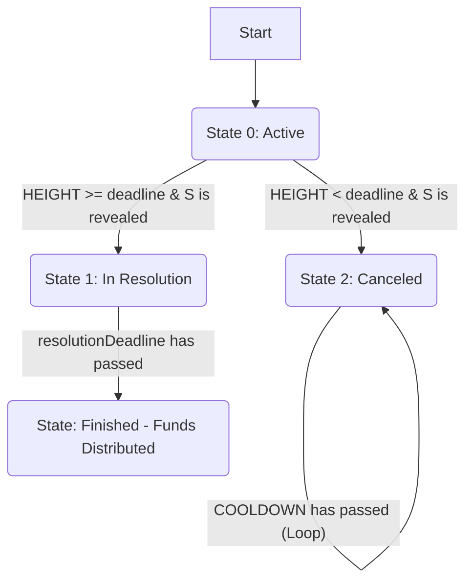

### **Contracts GoP**

This document provides an exhaustive technical description of the smart contract architecture governing a decentralized skill-based game on the Ergo blockchain. The system is designed to be secure, transparent, and censorship-resistant.

-----

### **1. Overall Architecture & Finite State Machine**

The game's lifecycle is managed by a set of five interacting smart contracts (Ergo Scripts). Each contract defines a specific phase or component, from its creation and active participation to its final resolution or cancellation.

The system is best described as a **Finite State Machine (FSM)**. The main game contract can exist in one of three states, defined in its **R4 register**. Transitions between these states are strictly controlled by the spending conditions of each contract.

-----

### **2. State 1: Active Game**

This is the initial phase where the game is created and players can submit their entries.

#### **2.1. Contract: `game_active.es`**

This contract acts as the main box holding the creator's stake and the game's rules while it is open for new participants.

  * **Purpose**: To maintain the game's configuration and the creator's collateral, and to manage the transition to the next phases.

  * **Registers**:

      * **R4: `Integer`**: Game state. In this phase, its value is **0 (Active)**.
      * **R5: `(Coll[Byte], Long)`**: `creatorInfo` - A tuple containing the creator's public key and their commission percentage.
      * **R6: `Coll[Byte]`**: `secretHash` - The Blake2b256 hash of a secret 'S', which is crucial for verifying scores later.
      * **R7: `Coll[Coll[Byte]]`**: `invitedJudgesReputationProofs` - A list of reputation token IDs from judges invited to oversee the game.
      * **R8: `Coll[Long]`**: `numericalParameters` - A collection of numeric values: `[deadline, creatorStake, participationFee]`.
      * **R9: `Coll[Byte]`**: `gameDetailsJsonHex` - Additional game details in JSON/Hex format.
      * **Tokens**: Contains a unique NFT that identifies the game.

  * **Spending Conditions (Actions)**:

    1.  **`action1_transitionToResolution`**: This is triggered **after** the `deadline` has passed.

          * **Requirement**: The creator must reveal the secret `S`, and its hash must match the `secretHash` stored in R6.
          * **Process**: This transaction consumes the `game_active` box and all valid `participation_submited.es` boxes. It calculates the real score of each participant using `S` and determines an initial winner.
          * **Output**: Creates a `game_resolution.es` box with the updated state and transforms the participation boxes into `participation_resolved.es` boxes.

    2.  **`action2_transitionToCancellation`**: This is triggered **before** the `deadline` has passed.

          * **Requirement**: Someone (not necessarily the creator) reveals the secret `S` prematurely.
          * **Process**: Penalizes the creator.
          * **Output**: Creates a `game_cancellation.es` box containing the creator's remaining stake and a payout box for the revealer, who claims a portion of the stake (1/5) as a reward.

#### **2.2. Contract: `participation_submited.es`**

Each player who joins the game creates a box of this type.

  * **Purpose**: To securely store a player's entry, their fee, and their hidden score.

  * **Registers**:

      * **R4: `Coll[Byte]`**: `playerPKBytes` - The player's public key.
      * **R5: `Coll[Byte]`**: `commitmentC` - A cryptographic commitment (`hash(solverId ++ score ++ hashLogs ++ S)`) that hides the player's true score.
      * **R6: `Coll[Byte]`**: `gameNftId` - The game's NFT ID to link this entry to the correct game.
      * **R7: `Coll[Byte]`**: `solverId` - An identifier for the solver or method used by the player.
      * **R8: `Coll[Byte]`**: `hashLogs` - A hash of the player's logs during their participation.
      * **R9: `Coll[Long]`**: `scoreList` - A list of scores, only one of which is real, to obfuscate the true result.

  * **Spending Conditions (Actions)**:

    1.  **`spentInValidGameResolution`**: Spent as part of the normal transition to the resolution phase (action 1 of `game_active.es`).
          * **Requirement**: The transaction must occur after the game's `deadline`.
          * **Output**: The box is recreated with the `participation_resolved.es` script, maintaining all its registers and value.
    2.  **`spentAsOmitted`**: Allows an entry that was omitted by the creator to be included during the resolution phase.
          * **Requirement**: The participation box must have been created before the game's original `deadline`.
          * **Output**: It is recreated as a `participation_resolved.es` box to be included in the final tally.
    3.  **`spentInValidGameCancellation`**: Allows the player to claim a full refund if the game is canceled.
          * **Requirement**: The corresponding `game_cancellation.es` box must be provided as a `data-input` in the transaction.
          * **Output**: Creates a payout box that returns the `participationFee` to the player (to their `playerPKBytes`).

-----

### **3. State 2: Resolution and Finality**

After the deadline, the game enters this phase to determine the winner and distribute the prizes.

#### **3.1. Contract: `game_resolution.es`**

The main game box during the final phase.

  * **Purpose**: To manage the final resolution, allow for the correction of omissions, and distribute the prizes.

  * **Registers**:

      * **R4: `Integer`**: Game state. In this phase, its value is **1 (Resolved)**.
      * **R5: `(Coll[Byte], Coll[Byte])`**: A tuple containing `(revealedSecretS, winnerCandidateCommitment)` - The revealed secret 'S' and the commitment of the current winning candidate.
      * **R6: `Coll[Coll[Byte]]`**: `participatingJudges` - A list of judges who actually participated (confirmed their involvement).
      * **R7: `Coll[Long]`**: `numericalParams` - `[deadline, creatorStake, participationFee, resolutionDeadline, resolvedCounter]`. It includes a new `resolutionDeadline` for this phase and a counter for resolved participations.
      * **R8: `(Coll[Byte], Long)`**: `resolverInfo` - The "Resolver's" public key and their commission percentage.
      * **R9: `(Coll[Byte], Coll[Byte])`**: `gameProvenance` - A tuple with the ORIGINAL CREATOR's public key and the game details.

  * **Spending Conditions (Actions)**:

    1.  **`action1_includeOmittedParticipation`**: Triggered **before** the `resolutionDeadline`.
          * **Requirement**: An omitted `participation_submited.es` box is provided as an input, and the current winner's box is provided as a `data-input`.
          * **Process**: Compares the score of the omitted entry with the current winner's. If the new score is higher (or equal but created earlier), the `winnerCandidateCommitment` is updated.
          * **Output**: The `game_resolution.es` box is recreated with the new winner candidate and the `resolvedCounter` is incremented.
    2.  **`action3_endGame`**: Triggered **after** the `resolutionDeadline`.
          * **Requirement**: The resolution period has ended.
          * **Process**: Calculates the total prize pool by summing the value of all `participation_resolved.es` boxes. It then calculates the commissions for the developer and the resolver.
          * **Output**: Distributes the funds: the prize to the winner (who also receives the game NFT), the commissions, and returns the stake to the creator/resolver. The system ensures no outputs with a value less than `MIN_ERG_BOX` are created.

#### **3.2. Contract: `participation_resolved.es`**

The final state of a valid participation box.

  * **Purpose**: To wait to be spent in the final `endGame` transaction.

  * **Registers**: Maintains the same register structure as `participation_submited.es` (R4-R9).

  * **Spending Conditions (Actions)**:

      * **`isValidEndGame`**: The only way to spend this box.
          * **Requirement**: It must be part of a transaction where the first input is the `game_resolution.es` box it belongs to (verified by the NFT), and the `HEIGHT` must be greater than or equal to the `resolutionDeadline`.

-----

### **4. State 3: Game Cancellation**

This is a penalty state triggered if the secret is revealed prematurely.

#### **4.1. Contract: `game_cancellation.es`**

  * **Purpose**: To manage the creator's stake in a way that allows it to be drained in portions as a penalty.

  * **Registers**:

      * **R4: `Integer`**: Game state. In this phase, its value is **2 (Canceled)**.
      * **R5: `Long`**: `unlockHeight` - The block height from which the next drain can be performed.
      * **R6: `Coll[Byte]`**: `revealedSecret` - The secret 'S' that was prematurely revealed.
      * **R7: `Long`**: `creatorStake` - The decreasing amount of the creator's stake.
      * **R8: `Coll[Byte]`**: `ReadOnlyInfo` - Immutable data about the game for reference.

  * **Spending Conditions (Actions)**:

    1.  **`action1_drainStake`**: The only possible action.
          * **Requirement**: `HEIGHT` must be greater than or equal to `unlockHeight`.
          * **Process**: Calculates a portion of the `currentStake` (1/5) to be claimed.
          * **Output**:
              * **Output 1 (`claimerOutput`)**: A box that delivers the claimed portion of the stake to the address of the transaction executor.
              * **Output 0 (`recreatedCancellationBox`)**: The box recreates itself with the reduced `creatorStake` and a new future `unlockHeight` (`HEIGHT + COOLDOWN_IN_BLOCKS`), continuing the cycle until the stake is depleted.